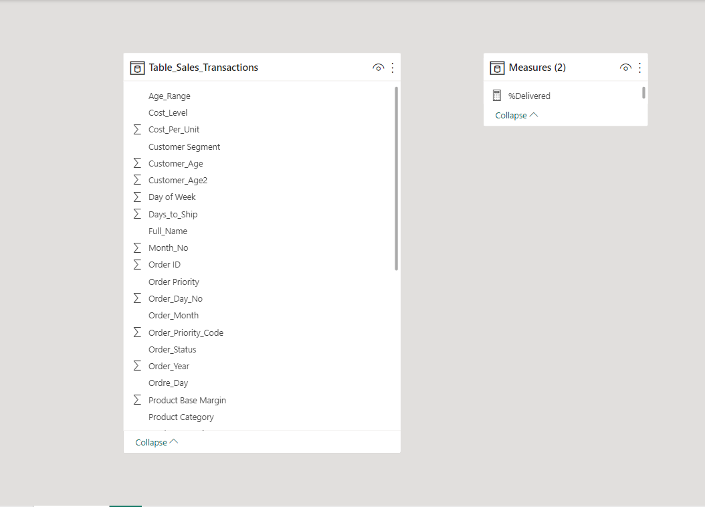
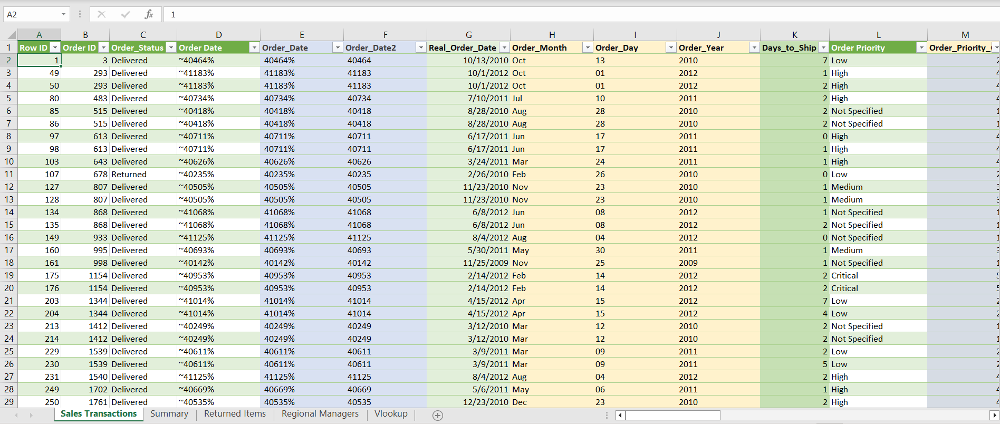
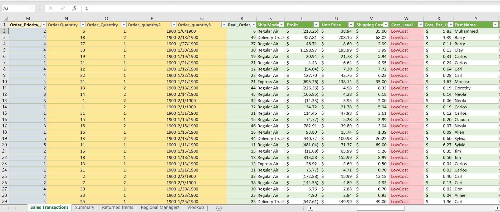
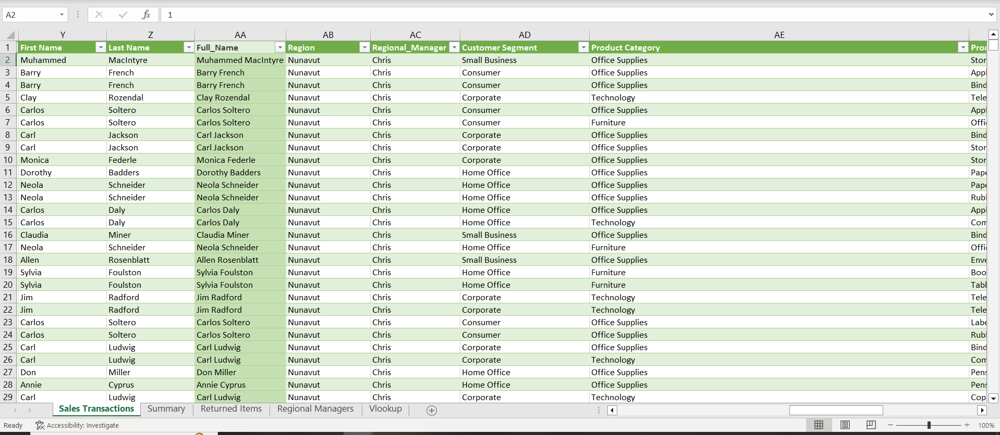
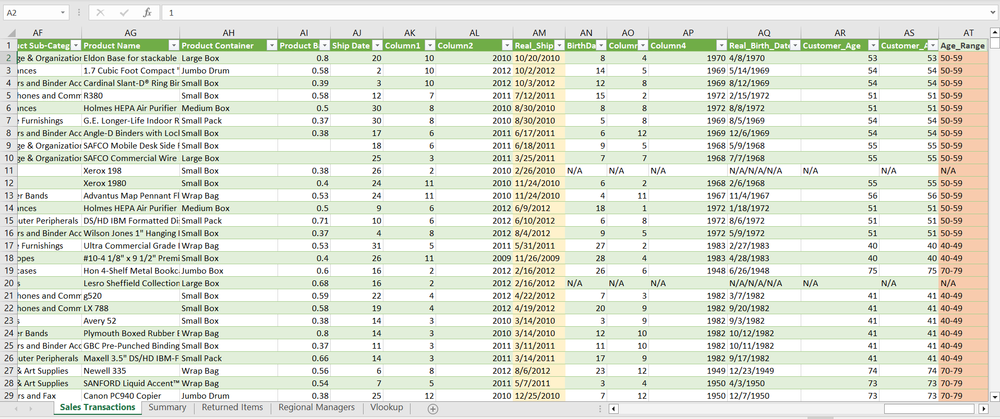
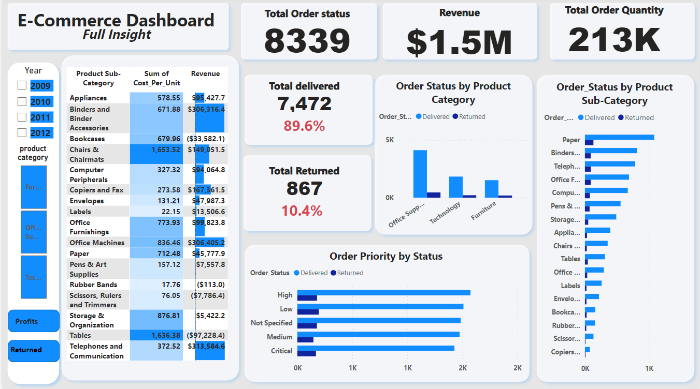

# E-Commerce-Insights

## Introduction
-----
This is a Power BI project for a **client**. The project is to analyze and derive insights to answer crucial questions and help him make data-driven decisions to improve business processes as well as profitability. 

**_Discliamer_**: _This dataset belongs to a client and he authorized me to use it here_. 

## Problem Statements 
1.  How Long on average does an order take to deliver?
2.  How many Critical (Order) priority orders took longer to ship than the mean (average) days to ship (from question 5)? Based on this key performance indicator, which region/manager is the worst offender?
3.  What is the total order made Yearly in the years in view?
4.	How many orders were delivered and returned?
5.	Which product category, region, and Customer Segment is most profitable?
6.	Revenue is based on the day of the week. Which weekday do we perform well the most? 
7.	What is the total profit made yearly? 
8.	Which Ship mode cost the most and by how much? What is the average shipping cost across all sales transactions?
9.	Which age group of customers is driving profitability, what is the commercial value (Revenue and Profit worth) of each age group?
10.	Looking to understand the drivers of returned orders. Which Product Category, Region, and Manager is this predominant to? How much revenue was lost due to returned products? Make some recommendations on how we can prevent this.

## Skills Demonstrated:
### Excel
**The following MS Excel Functions were used:
- VLOOKUP, 
- Substitution,
- Text (Date Path Extraction),
-  Type casting, 
-  Text to Column (Data Parsing),
-   Concatenate, 
-   IFS, 
-   IFERROR (Error trapping),
-    Date.
-    CtrlF
### Power bi:
**The following Power Bi Features were Incorporated: 
- DAX, 
- Quick measures,
- Page Navigation,
-  Modelling, 
-  filters 
-  tooltips

## Modeling 
Single table was imported into the Power Bi 
Tables already joined together in the excel using *Vlookup*
Another Table was created to accomodate the calculated measures. 

**Data Source** 

The data came in a Text/CSV file extracted into an Excel sheet for cleaning, then extracted into power bi for further cleaning, analysis, and visualization.
It contains 3 sheets/tables.
1.	Sales Transaction table  with 8,399 rows and 22 columns
2.	Returned items table with 573 rows and 2 columns. 
3.	Regional Manager tabel  with 8 rows and 2 columns.

Data Transformation/Cleaning
Excel Concept Applied
Data was cleaned and transformed with Microsoft *EXCEL and Power Query Editor of Power bi*

   

some of the applied steps included:

**[Order_Date] TO [Real_Order_date]**

*SUBSTITUTION* function to clean the spurious values from the *[order Date]* column. 
*TYPE CASTING* to convert strings to numerical values to generate the *[Order_date2]* column.
*SHORT DATE* to convert the numerical values to date hence the *[Real_Order_Date]* column.
*DATE PATH EXTRACTION* using *(TEXT)* function to derive *[Order Day], [Order-month], [Order year] from [Real_Order_Date]*

**[Order Quantity] TO [Real_Order_Quantity]**

_The data came in a date format, so I must convert it to numerical values. (dd/mm/yyyy).
*DATA PARSING (Text to Column)* function to separate data into different data points (columns).
*CONCATENATE* function to Join the data points by Delimiter (“/”) (mm/dd/yyyy).
*TYPE CASTING* to convert the date format to a whole number hence *[Real_Oder_Quantity]*
*IFS* function to derive *[Priority_Code] from [OrderPriority]* column.

_Derived a new column *[Date_to-ship]*.

*[Ship_Date]- [Real_Order_date] = [Date_to_ship]*.
However, the date values in the *[ship_date]* column were in (dd/mm/yyyy) format so must convert it to (mm/dd/yyyy) format using the *(Text to column)* function to separate the values into different data points.
*CONCATENATE* function to join them together using a delimiter. 

**[Birth Date] TO [Real_Birth_date]**

The date values in the *[BirthDate]* column was in (dd/mm/yyyy) format so must convert it to (mm/dd/yyyy) format using the *(Text to column)* function to separate the values into different data points. 
*CONCATENATE* function to join them together using a delimiter hence *[Real_birth_date]*

Derived the [Customer_Age] used the formula _= YEAR (NOW ()) – YEAR([Real_birth_date])_
*ERROR TRAPPING* used _= IFERROR (YEAR (NOW ()) – YEAR([Real_birth_date]),” N/A”)_ to replace the missing values with “N/A”.
Derive *[Customer_age_range]*. The customer’s Age is between 38-109, so I created another table for the age range 
Customer_age	Age range

VLOOKUP function to match the tables *_(Sales_Transaction) and (Agerange)_* to return *[age_range]*
_=VLOOKUP (Customer_Age,agerange table,2, TRUE)_
Using *[Customer_age]* as the common column.
*ERROR TRAPPING used IFERROR* to return the “N/A” values. 

*[Cost_Per_Unit] = [Shipping Cost]/[Real_Order_Quantity]*

*[Cost_Level]* column. 

Find the average shipping cost from the *[Shipping Cost]* column.(12.84)
Then used the *IFS* function to derive *[Cost_Level]*
_IFS [shipping cost] >avgcost,” HighCost”, [shipping cost] <avgcost,” LowCost”, [shipping cost] =   avgcost, ” AverageCost”_

Then used *Conditional Formatting* to assign colors to *[cost level]*

Used *VLOOKUP* Function to match the Retuned items Table with the sales Transaction Table
using *[order ID]* as the common column.

_=VLOOKUP ([Order ID], TableReturned_items,2, False)_

*ERROR TRAPPING* used *IFERROR* to replace the errors with “Delivered.”

_=IFERROR (VLOOKUP ([Order ID], TableReturned_items,2, False),” Delivered”)_

VLOOKUP to match the regional manager’s table using [Region] as the common column.

**Power Query Editor Concepts 

Filter rows in *[Customer_age]* that contain “N/A.”

Extract *[Day_Name]* using a custom column.

Inserted column *[Day of the week]* using custom columns.

## Visualization

The report comprices of 4 Pages 
1. order
2. Returned
3. Profit
4. Map

## Analysis

### Order

The store currently has a total of 795 customers.
- Total Order 213k
- Total order status = 8,339
- Total delivered = 7,472 (89.4%)
- Total revenue = 1.5m dollars

### Returned 

- Total Returned = 867 (10.4)
- Average days to ship =2.03
- average shipping cost = 12.84 dollars
- max days to ship = 92
- Min days to ship =0

### Profit 

- Total profit = 1.317m dollars
- Total loss = 196.1k dollars

### Map 

Showing the goegraphical locations of outlets and profit

## Conclusion and Recommendation

Total Profit (1.32m dollars)
Yearly Profit
- 2009 (357.97k dollars)
- 2010 (322.51k dollars)
- 2011 (370.80k dollars)
- 2012 (266.15k dollars)
- Pat is the most profitable regional manager by generating Revenue (56.12%) and profit (56.91%) among other managers. He manages three regions (West, Ontario, and Quebec), and the regions generated (20.79%) and (20.13%), and (9.3%) profits respectively.
- In the period in view, October is the month with the highest profit of 156,789. 
- While Friday is the day of the week with the highest profit of 247,549 (18.79%) and Revenue (18.97%). 
_Note: High revenue on the weekends_
- The age range 50-59 is the driver of the highest profit (36.43%) and Revenue (38.09%)
- Technology drives the highest profits (58.3%) in the product category.
- The customer segment with the highest profit (38.28%) and Revenue (39.40%)

*Revenue loss due to returned orders (Items) = (196.1K dollars) and the major drivers are as thus*. 
- Product category – office supply (52.94%)
- Region – Ontario (26.99%)
- Manager – Pat (63.09%)
- Ship mode – Regular Air (87.49%)

## Recommendations
- To reduce the number of returned items we must ensure that Orders are shipped on or before the average Days to ship (2 days). as the shipping dates is a major factor for returned items 
- Attention is to be paid to the regular air operators to ensure faster delivery. 

